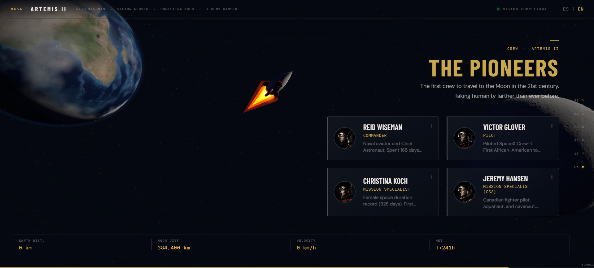

# ARTEMIS II — Interactive Mission Experience

[](https://threejs.org/)
[](https://animejs.com/)
[](https://developer.mozilla.org/en-US/docs/Web/JavaScript)
[](https://www.w3.org/WAI/fundamentals/accessibility-intro/)

An immersive, editorial-style web experience depicting the **Artemis II** lunar mission. This project blends high-end 3D graphics with a scroll-driven narrative, providing a cinematic journey from launch to splashdown.

---

## 🚀 Preview


*Artemis II: Cinematic Mission Experience.*

---

## ✨ Features

- **3D Cinematic Scrolling:** An interactive timeline using `Three.js` and `Anime.js` that reacts to your scroll, following the Orion spacecraft through 6 distinct mission phases.
- **Dynamic Telemetry:** Real-time mission data (distance, speed, MET) that updates as you progress through the flight path.
- **Immersive 3D Environments:** High-resolution Earth and Moon models with displacement mapping and fractal noise-generated cloud layers.
- **Bilingual Support:** Full toggle between **Spanish** and **English**, including dynamic data and UI elements.
- **Crew Profiles:** Interactive modal system to explore the background and roles of the Artemis II pioneers.
- **Advanced A11y:** Full keyboard navigation support (Tab, Enter, Space, Escape) and screen-reader friendly structure.
- **Responsive Design:** Optimized for mobile, tablet, and desktop viewports with adaptive 3D camera framing.

---

## 🛠️ Tech Stack

- **Graphics:** [Three.js](https://threejs.org/) (WebGL)
- **Animation:** [Anime.js](https://animejs.com/)
- **Styling:** Vanilla CSS (Mission Control Editorial Theme)
- **Logic:** Vanilla JavaScript (ES6+)

---

## 📦 Installation & Local Setup

1. **Clone the repository:**
   ```bash
   git clone https://github.com/YOUR_USERNAME/artemis-ii.git
   ```

2. **Navigate to the directory:**
   ```bash
   cd artemis-ii
   ```

3. **Install dependencies:**
   ```bash
   npm install
   ```

4. **Run the development server:**
   ```bash
   # If using a local server like Live Server or a node script
   npm start
   ```

---

## 🛰️ Mission Phases

0. **Launch:** Liftoff from KSC Pad 39B.
1. **Interlunar Transit:** Deep space systems check and Earth departure.
2. **Sphere of Influence:** Approaching the Moon's gravity well.
3. **Lunar Flyby:** Entering the dark side of the Moon (Comm Blackout).
4. **Return:** Earthrise and high-speed return trajectory.
5. **Splashdown:** Re-entry and mission completion.

---

## 📜 License

This project was created for educational and creative purposes. Textures and assets are sourced from NASA and public domain repositories.

---

*“We go together to the Moon and beyond.”*
